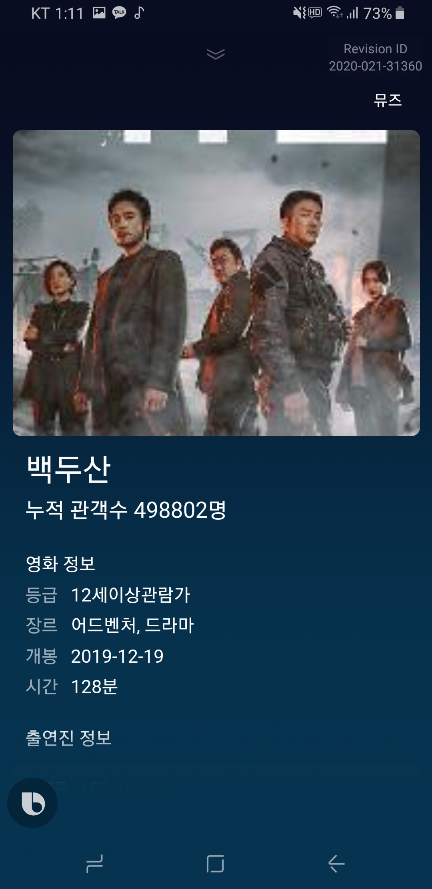
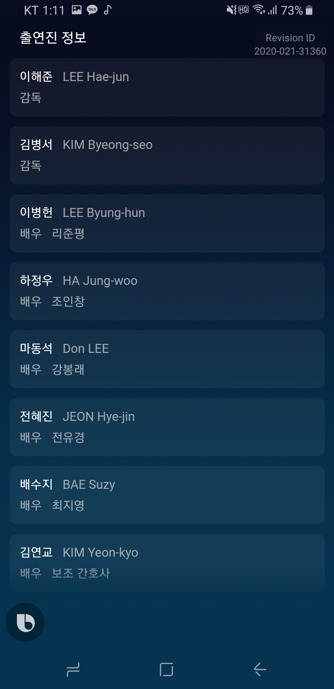
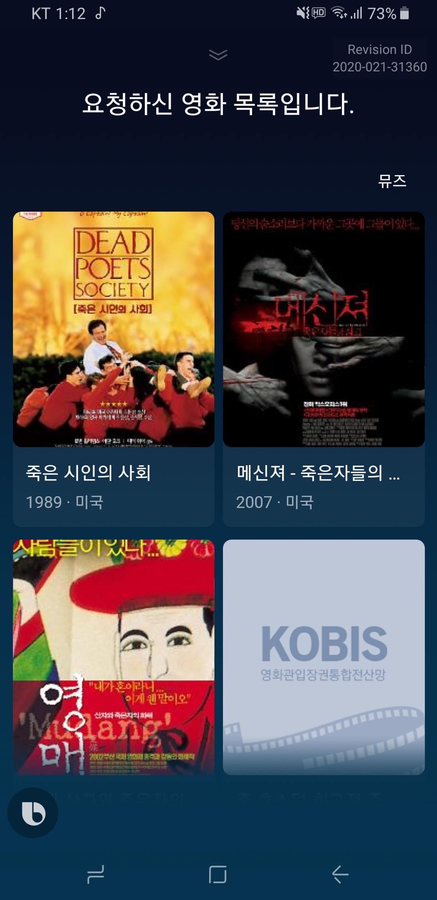

# Muze

<div align="center" style="display:flex;">
	
</div>

\
[]()

<div align="center">
SAMSUNG Bixby Hackton **SERVER**

영화의 이름과 대략적인 개봉 날짜만으로도 

지금까지 개봉한 약 76000여개의 영화를 손쉽게 검색할 수 있는 **Bixby Capsule Muze.**
</div>

\
\
[]()
### 🍍 Introduce My project
* Bixby 음성인식을 이용해 76000건의 영화 검색 및 Detail 조회
* 일간/주간 박스 오피스 조회
* 영화 이미지 크롤링 및 캐싱

\
[]()
### 👤 Comment
12시간의 짧은 해커톤이었지만, 클린코드와 클린 아키텍처를 신경씀.\
[[참고] 우아한형제들: 주니어 개발자의 클린 아키텍처 맛보기](http://woowabros.github.io/tools/2019/10/02/clean-architecture-experience.html)

 | 박스오피스 | 영화 디테일 | 배우 검색 | 영화 검색 |
|:---:|:---:| :---:|:---:|
 | | |  |  |

\
[]()
### 📚 API Docs
[API DOC Link(Git wiki)](https://github.com/Bixby-Muze/muze-server/wiki)

\
[]()
### 🛠 Core Technology
* Spring security.
* Auto collect movie img data.
* Using Movie Data.
* Crawling.

\
[]()
### ⚙️  Dependencies
```gradle
dependencies {
    compile('org.springframework.security:spring-security-oauth2-client')
    compile('org.springframework.security:spring-security-oauth2-jose')
    compile('org.springframework.boot:spring-boot-starter-security')
    compile group: 'com.auth0', name: 'java-jwt', version: '3.3.0'
}
```
> Securiy와 JWT를 활용하여, 회원가입 / 로그인 기능을 구현. (**AOP** 적용)